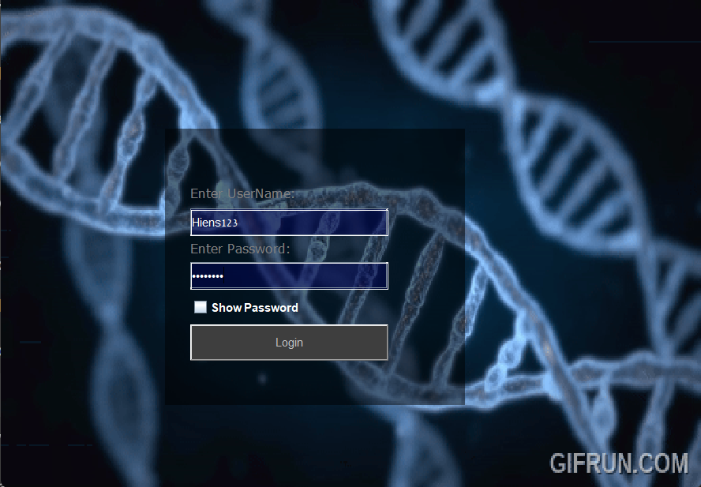
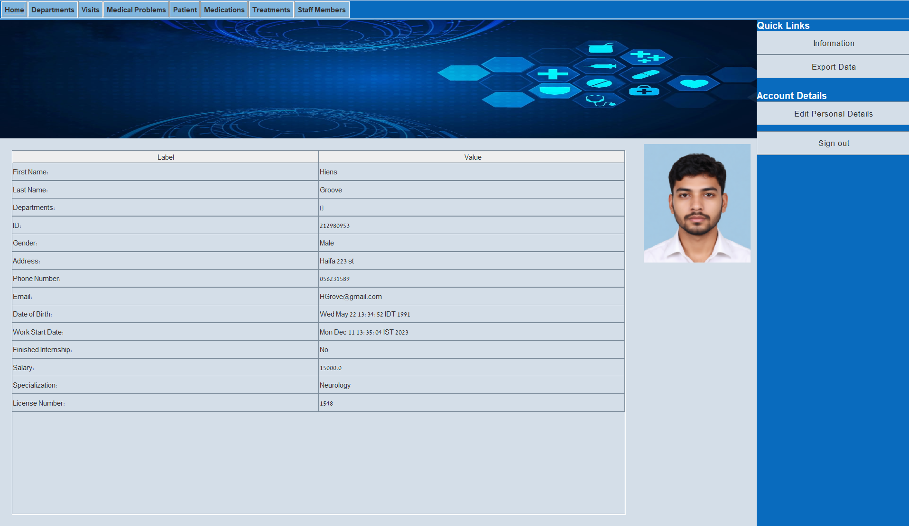

# Hospital Management System

## Overview
Hospital Management System is a Java-based desktop application designed to manage and simulate real-world hospital operations through an interactive graphical user interface.

The system models key healthcare entities such as patients, staff members, departments, treatments, medications, medical problems, and visits. It provides a structured approach to handling complex workflows and relationships inside a hospital environment.

This project focuses on applying software engineering principles including object-oriented design, modular architecture, exception handling, and GUI development.

---

## Key Features
- Role-based login system
- Patient record and history management
- Staff member management
- Department management
- Treatment and medication tracking
- Visit scheduling and documentation
- Medical problem tracking
- Data export to CSV format
- Custom exception handling
- Interactive GUI built with Java Swing

---

## Technologies Used
- Java
- Java Swing
- Object-Oriented Programming (OOP)
- Custom Exception Handling
- File Serialization
- CSV Data Handling
- External UI Libraries: JGoodies, MigLayout, JCalendar

---

## System Design & Architecture
The project follows a modular architecture with clear separation of concerns:

- **Model Layer** – Represents core domain entities such as patients, staff members, departments, treatments, medications, and visits.
- **Control Layer** – Handles business logic and system operations.
- **View Layer** – Implements the graphical user interface.
- **Panels Layer** – Contains reusable GUI panels.
- **Utilities Layer** – Provides helper functions such as file export and data handling.
- **Exception Layer** – Includes custom exceptions for safer and more reliable system behavior.

This structure improves maintainability, readability, and scalability.

---

## Project Structure
```text
src/
├── control/          Business logic and system controllers
├── model/            Core system entities
├── view/             GUI screens and interface components
├── panels/           Reusable GUI panels
├── exceptions/       Custom exception classes
├── utils/            Helper and utility classes
├── enums/            Enumeration types
├── Patient/          Patient-related modules
├── staffMember/      Staff management modules
├── department/       Department modules
├── medicalProblem/   Medical problem modules
├── medication/       Medication modules
├── treatment/        Treatment modules
└── visit/            Visit management modules
```

---

## Screenshots
Screenshots will be added to demonstrate the main user interface and system workflows.

### Login Screen


### Main Dashboard


### Patient Management


### Visit Management


-->

---

## How to Run
1. Clone or download the repository.
2. Open the project in Eclipse or IntelliJ IDEA.
3. Add all included `.jar` files to the project build path.
4. Run the application from the login screen class inside `src/view`.

---

## Project Context
This project was developed as part of an academic Object-Oriented Programming course.

It demonstrates the ability to analyze requirements, design a structured software system, implement GUI-based workflows, and organize code using object-oriented principles.

---

## Skills Demonstrated
- Java application development
- Object-oriented programming
- GUI development using Java Swing
- Modular software architecture
- Separation of concerns
- Custom exception handling
- File handling and CSV export
- Real-world system modeling
- Translating requirements into working software
